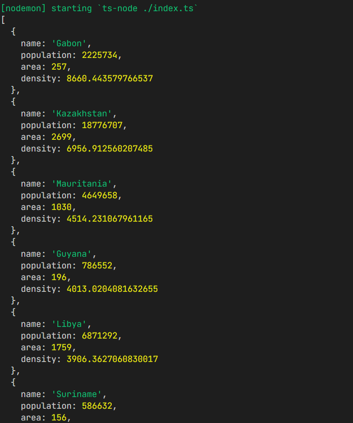

# Countries

  

## Practica con node 

Crear un script para ejecutar con Node:

 - Crear archivo indeex.ts que se pueda ejecurtar con 'node index.ts'

 - Crear un archivo .txt con un listado de países

 - Incluir el archivo .txt en .gitignore

 - Leer todos los países y calcular la densidad de población de cada país

 - Reordenar la lista de países, con los países más densos primero
 
 - Escribir la lista en formato CSV en un archivo nuevo paises.csv (sin biblioteca)

## Script
Ejecuta:
### `npm run dev`

## Tecnologías 

 
 